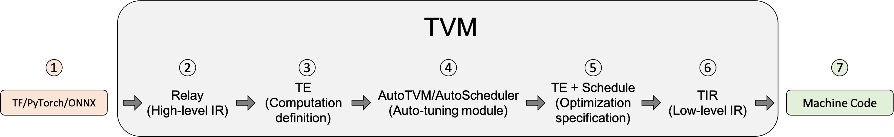

# TVM

TVM is an open-source machine learning (ML) **compiler framework** that aims to enable efficient deployment of deep learning models on various hardware platforms. It addresses a critical challenge in the field of deep learning: the diversity of hardware accelerators and the need for optimization to achieve high performance across different devices. TVM acts as both a compiler and an optimizer for deep learning models. Its primary role is to bridge the gap between the diverse world of deep learning frameworks and the wide array of hardware platforms available for deploying AI models.

- **Hardware Agnostic**: TVM can target a broad range of hardware platforms, including CPUs, GPUs, TPUs, and specialized accelerators. It abstracts away the complexity of optimizing for different hardware, making it easier to deploy models across diverse devices.

- **Framework Agnostic**: It provides compatibility with models from various deep learning frameworks, such as TensorFlow, PyTorch, MXNet, and Keras, by converting these models into its optimized intermediate representation (IR).

- **Optimization**:  TVM uses advanced optimization techniques, including operator fusion, automatic layout transformation, and efficient memory management, to enhance the performance of deep learning models. These optimizations are performed at both the graph level and the operator level.

- **AutoTVM and AutoSchedule**: These are automated optimization tools within TVM that use machine learning to find the most efficient way to execute models on a given target hardware. They dramatically reduce the manual effort required for optimizing model performance.

- **Cross-Platform Deployment**: With TVM, developers can compile and optimize models on a development machine and then deploy them on different target devices, significantly simplifying the deployment process.

The TVM is primarily developed in C++ for its core components, ensuring efficient execution and flexibility in handling low-level operations. Alongside C++, TVM also heavily utilizes Python for its front-end interface, making it accessible and user-friendly for the machine learning community. Python is used for defining models, setting up compilation and optimization processes, and interfacing with different deep learning frameworks. The combination of C++ and Python leverages the strengths of both languages: C++ provides performance and efficiency critical for compiler operations and execution on various hardware, while Python offers ease of use, readability, and the ability to quickly integrate with other machine learning tools and libraries.

TVM Schema [Source: <a href="https://tvm.apache.org/docs/tutorial/introduction.html">TVM Documentation]</a>

The following text was extracted from [TVM Documentation](https://tvm.apache.org/docs/tutorial/introduction.html):

1. Import the model from a framework like Tensorflow, PyTorch, or Onnx. The importer layer is where TVM can ingest models from other frameworks, like Tensorflow, PyTorch, or ONNX. The level of support that TVM offers for each frontend varies as we are constantly improving the open source project. If you’re having issues importing your model into TVM, you may want to try converting it to ONNX.

2. Translate to Relay, TVM’s high-level model language. A model that has been imported into TVM is represented in Relay. Relay is a functional language and intermediate representation (IR) for neural networks. It has support for:

- Traditional data flow-style representations.
- Functional-style scoping, let-binding which makes it a fully featured differentiable language.
- Ability to allow the user to mix the two programming styles.

Relay applies graph-level optimization passes to optimize the model.

3. Lower to Tensor Expression (TE) representation. Lowering is when a higher-level representation is transformed into a lower-level representation. After applying the high-level optimizations, Relay runs FuseOps pass to partition the model into many small subgraphs and lowers the subgraphs to TE representation. Tensor Expression (TE) is a domain-specific language for describing tensor computations. TE also provides several schedule primitives to specify low-level loop optimizations, such as tiling, vectorization, parallelization, unrolling, and fusion. To aid in the process of converting Relay representation into TE representation, TVM includes a Tensor Operator Inventory (TOPI) that has pre-defined templates of common tensor operators (e.g., conv2d, transpose).

4. Search for the best schedule using the auto-tuning module AutoTVM or AutoScheduler. A schedule specifies the low-level loop optimizations for an operator or subgraph defined in TE. Auto-tuning modules search for the best schedule and compare them with cost models and on-device measurements.

- **AutoTVM**: A template-based auto-tuning module. It runs search algorithms to find the best values for the tunable knobs in a user-defined template. For common operators, their templates are already provided in TOPI.

- **AutoScheduler (a.k.a. Ansor)**: A template-free auto-tuning module. It does not require pre-defined schedule templates. Instead, it generates the search space automatically by analyzing the computation definition. It then searches for the best schedule in the generated search space.

5. Choose the optimal configurations for model compilation. After tuning, the auto-tuning module generates tuning records in JSON format. This step picks the best schedule for each subgraph.

6. Lower to Tensor Intermediate Representation (TIR), TVM’s low-level intermediate representation. After selecting the optimal configurations based on the tuning step, each TE subgraph is lowered to TIR and be optimized by low-level optimization passes. Next, the optimized TIR is lowered to the target compiler of the hardware platform. This is the final code generation phase to produce an optimized model that can be deployed into production. TVM supports several different compiler backends including:

- LLVM, which can target arbitrary microprocessor architecture including standard x86 and ARM processors, AMDGPU and NVPTX code generation, and any other platform supported by LLVM.

- Specialized compilers, such as NVCC, NVIDIA’s compiler.

- Embedded and specialized targets, which are implemented through TVM’s Bring Your Own Codegen (BYOC) framework.

7. Compile down to machine code. At the end of this process, the compiler-specific generated code can be lowered to machine code. 

TVM can compile models down to a linkable object module, which can then be run with a lightweight TVM runtime that provides C APIs to dynamically load the model, and entry points for other languages such as Python and Rust. TVM can also build a bundled deployment in which the runtime is combined with the model in a single package.

# How TVM uses LLVM?

Once TVM has performed high-level optimizations on the deep learning model's computation graph and transformed it into a low-level intermediate representation (IR), it uses LLVM to generate efficient machine code for the target hardware platform. The main benefits of using the LLVM are:

- **Portability**: LLVM's wide support for different hardware architectures enhances TVM's goal of enabling machine learning models to run on diverse platforms. This support simplifies the process of deploying AI applications across various devices and systems.

- **Performance**: LLVM's optimizations are crucial for achieving high performance. They ensure that the generated machine code is not only correct but also as efficient as possible, taking advantage of specific features of the target hardware.

TVM's integration with LLVM is a key factor in its ability to compile and optimize deep learning models for a broad range of hardware platforms efficiently. This collaboration allows TVM to focus on higher-level optimizations specific to machine learning workloads while relying on LLVM for general-purpose code generation and optimization capabilities.

